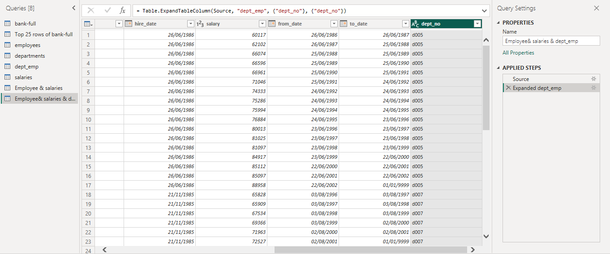

# Fresh start with Power BI

---
The journey to learning Power BI starts with the basics of importing data into Power BI desktop from different sources. In this task, two sets of data were imported into Power BI desktop, an Excel csv file and a csv file from SQL.

The files were imported through the **get data** portal in Power BI. For the Excel csv file, this option was selected from the drop down list and the browse tab was used to get the file location and upload the file into Power BI desktop.

Please find below screenshots of the achieved result.

---

For the SQL file, the same Excel csv file was first uploaded into a database in SQL, and then only the top 25 rows of the dataset was imported to the Power BI desktop. This was achieved by writing out a query in Power BI Desktop to select out only 25 rows, after selecting the SQL path for data upload.

Please find below screenshots of the achieved result.

---

After this, another dataset; Employee data (Excel csv format) was imported into the Power BI desktop and data cleaning was then carried out on this dataset. Steps involved include:

- Used the firt row as header, listed as **Promoted header.**
- Checked for duplicates, no duplicates found.
- Datatype corrections, standardization and formatting e.g. currency and text datatypes listed as **Changed type**
- Column naming to suit the data therein, listed as **Renamed columns**
- Merged first name and last name columns to get full name column, listed as **Inserted Merged Column**
- Reordered the columns to place the Full name close to the gender column, listed as **Reordered Columns**
  

Please find below screenshots of the data cleaning steps.

---

Another task carried out was joining/ merging of tables. Three other tables in Excel csv file format were imported and **Transform data**  was selected to import them directly into the Power Query Editor where all the editing and merging was achieved. The three other tables are:

- Salaries data 
- Department data
- Dept_emp data
  
The imported data were cleaned before merging together. These datasets shared a common column with another, and this common column served as the joining platform for the four tables. 

Steps involved include:

- The Employee table was joined to the salaries table first using the **Left Outer Join Kind** with the **common column Emp_no**, this was named as **Employee & salaries table**. The salaries table was then expanded to join in the desired columns selected.
  

Showing the three newly added columns

---

- Then, the dept_emp table was added to the Employee & salaries table created above using the same steps as above with the **common column Emp_no**. This was named **Employee & salaries & dept_emp table.** 

Showing the newly added column

---

- Finally, the Department table was added to th Employee & salaries & dept_emp table created above using the same steps with the **common column Dept_no**.This was named **complete Employee Info.** 

Showing the newly added column

---

In conclusion, this beginner's tasks show that data can be imported into Power BI from different sources, can be cleaned, edited and merged using functions in the Power Query Editor and then applied to the Power BI desktop for detailed analysis.

---

